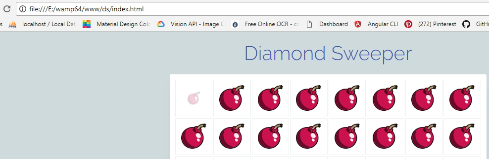

# DiamondSweeper

Simple puzzle game created on Angular 5.2.0

There are 8 hidden diamonds placed on the board. Click each boxes to find the diamond. Once you get 8 diamonds, you will get some points..

## Instructions

1. Click each boxes to find the hidden diamond.
2. Once you get 8, you will be redirected to success screen. Here you will get a point which will be sum of remaining boxes and success count.
3. "Start Again" to play the game again.

## Requirements

1. Node & npm should be installed on your machine.
2. Project is created on Angular 5.2.0. So Angular 5.2.0 and its dependencies will be downloaded while installing the project.

## Installation

1. Download project files to your machine.
2. 'npm install' from the directory to install project.
3. 'ng serve -o' to run the project on your browser.

## Dist files
You can also run the project without using npm or Angular.
1. Download files in dist folder.
2. Run index.html on your browser.
3. If you are facing any trouble, please check &lt;base href="/"&gt;. Here you have to give valuable href value.

Here my file path is 'file:///E:/wamp64/www/ds/' and my base path is also the same.